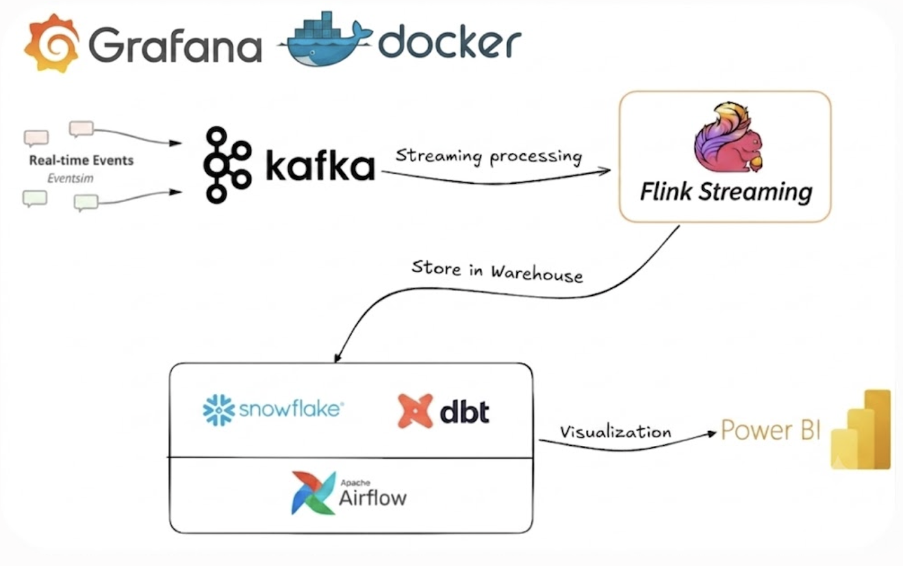
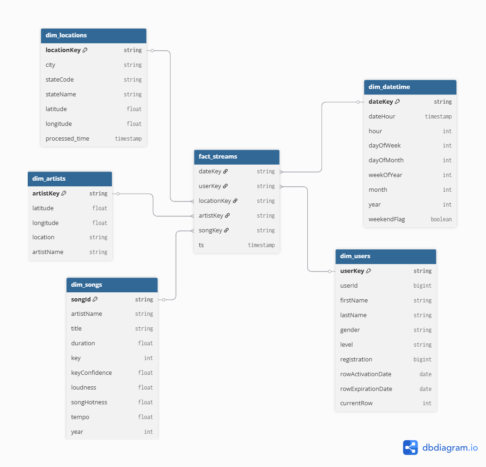
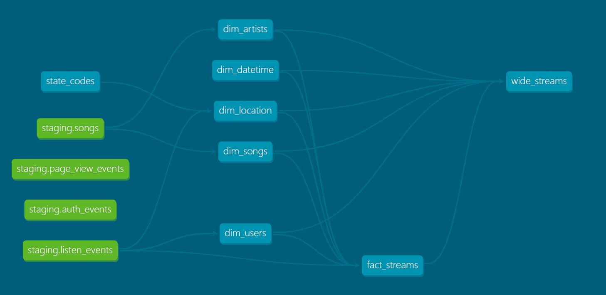
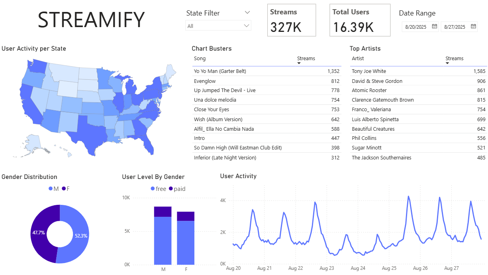

# Streamify: End-to-End Music Event Data Platform

Streamify is a comprehensive data engineering project that demonstrates a full, end-to-end data pipeline. It simulates, processes, and analyzes real-time music streaming events, transforming raw data into actionable business intelligence.

This platform captures simulated user interactions (like 'song played' or 'artist listened to'), processes them in real-time, stores them in a modern data warehouse, models them for analytics, and finally visualizes the resulting insights.

-----

## 💾 Dataset

[Eventsim](https://github.com/Interana/eventsim) is a program that generates event data to replicate page requests for a fake music website. The results look like real use data but are completely synthetic.

The Docker image is borrowed from [viirya's fork](https://github.com/viirya/eventsim), as the original project is unmaintained. Eventsim uses song data from the [Million Songs Dataset](http://millionsongdataset.com); this project uses a [subset](http://millionsongdataset.com/pages/getting-dataset/#subset) of 10,000 songs.

---

## 📈 Project Architecture & Data Flow

  
</p\>

The project follows a modern data stack (ELT) architecture, composed of nine layers:

| Layer | Tool | Role |
|---|---|---|
| Data simulation | Eventsim | Generates synthetic music-streaming events based on the Million Songs Dataset |
| Message queue | Apache Kafka 4.3 (KRaft) | 3-node cluster, replication factor 3, 3 partitions per topic — no Zookeeper |
| Stream processing | Apache Flink 1.18 (PyFlink) | Real-time parsing and enrichment; 3 TaskManagers at parallelism 3 to match Kafka partitions |
| Data warehouse | Snowflake | Cloud-native analytical storage; receives processed data from Flink |
| Transformation | dbt | SQL-based star schema and wide-table modelling inside Snowflake |
| Orchestration | Apache Airflow | Schedules daily dbt runs via a DockerOperator DAG |
| Visualisation | Power BI | Interactive dashboards connected to the star schema in Snowflake |
| Monitoring | Prometheus & Grafana | Real-time observability for Kafka lag, Flink throughput, and per-TaskManager CPU/memory |
| Containerisation | Docker Compose | Single-command reproducible deployment of the full stack |

### Scaling Design

**Kafka** runs as a three-node KRaft cluster (`broker-1`, `broker-2`, `broker-3`). Each of the three event topics (`listen_events`, `page_view_events`, `auth_events`) has **3 partitions** and **replication factor 3**, so every partition has a replica on each broker — no data loss if one broker restarts.

**Flink** is scaled to **3 TaskManagers**, each with 4 task slots, running the PyFlink job at **parallelism 3**. With slot sharing, each TaskManager handles one complete Source → UDF → Sink pipeline, consuming one partition of each topic in parallel. Ten-second checkpointing commits consumer-group offsets back to Kafka, making lag visible to the monitoring stack.

**Monitoring** is provided by a Prometheus + Grafana stack with three pre-built dashboards:
- **Kafka Lag** — consumer-group lag and consumption rate per topic
- **Flink Record Processing** — records ingested per second per source operator
- **Flink CPU / Memory** — per-TaskManager JVM CPU load, heap, and managed memory

### Access URLs

| Service | URL |
|---|---|
| Flink Web UI | http://localhost:8083 |
| Prometheus | http://localhost:9090 |
| Grafana | http://localhost:3000 |

1.  **Data Simulation (Eventsim):** Real-time music event data (e.g., page views, song plays) is generated using **[Eventsim](https://github.com/Interana/eventsim)** to simulate a real-world user base.
2.  **Ingestion & Messaging (Kafka):** The raw event data is captured by **Apache Kafka 4.3** running in **KRaft mode** (no Zookeeper) as a 3-node cluster. Each topic has 3 partitions with replication factor 3 for fault tolerance.
3.  **Real-Time Processing (Apache Flink):** **Apache Flink 1.18** connects to Kafka and processes the event stream in real-time using PyFlink's Table/SQL API. Three TaskManagers run in parallel — one per Kafka partition — with checkpointing enabled for exactly-once semantics.
4.  **Cloud Data Warehouse (Snowflake):** **Snowflake** serves as the central data warehouse, providing a scalable "single source of truth" for all processed data from Flink.
5.  **Data Transformation (dbt):** Once the data is in Snowflake, **dbt** runs transformation jobs to convert it into a clean, analytics-ready **star schema**.
6.  **Orchestration (Airflow):** **Apache Airflow** manages the workflow, orchestrating the dbt transformations on a daily schedule.
7.  **Business Intelligence (Power BI):** **Power BI** connects to Snowflake, consuming the clean data from the star schema to visualize insights through interactive dashboards.
8.  **Monitoring (Prometheus & Grafana):** **Prometheus** scrapes metrics from Flink's built-in reporter and kafka-exporter. **Grafana** visualizes Kafka consumer-group lag, Flink record throughput, and per-TaskManager CPU and memory across three dashboards.

---

## 🗂️ Data Modeling & Transformation (dbt)

This project uses dbt to manage and execute two main types of data models in Snowflake:

1.  **Star Schema:**
    * This is the primary, normalized storage model.
    * It consists of one central fact table (`fact_streams`) and five dimension tables (`dim_users`, `dim_songs`, `dim_artists`, `dim_locations`, `dim_datetime`).
    * This structure is highly efficient for storage, maintaining data integrity, and avoiding redundancy.

  
</p\>

2.  **Wide Table (`wide_streams`):**
    * This is a wide, denormalized table/view built *from* the star schema.
    * **Purpose:** To provide a single, "flattened" table for BI tools (like Power BI).
    * **How it works:** It pre-joins the `fact_streams` table with all five dimension tables.
    * **Benefits:** By performing the JOINs in advance, this model simplifies queries in Power BI, significantly improves dashboard loading speeds, and makes it easier for end-users to self-analyze data without needing to understand complex relationships.

  
</p\>

-----

## 📊 Results Dashboard

Visualizations are created in Power BI, connected directly to the star schema models in Snowflake.

  
</p\>

-----
