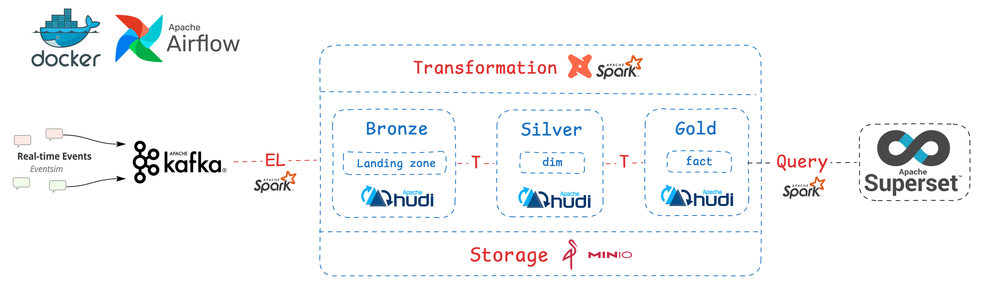
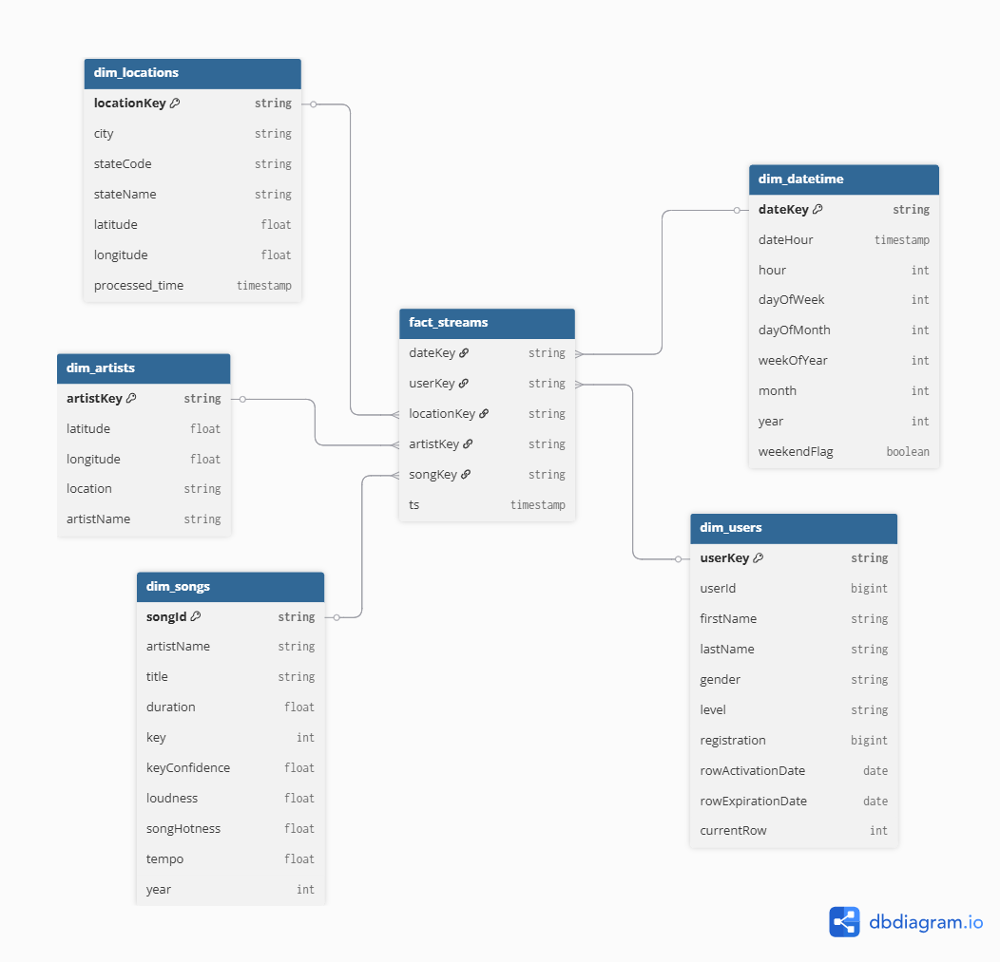
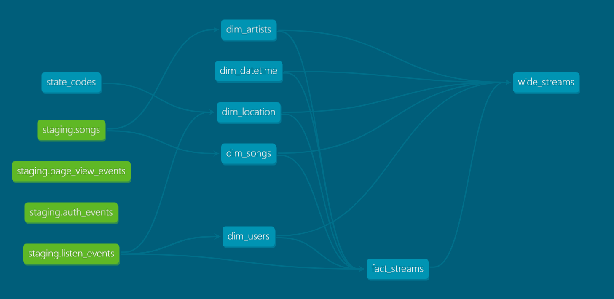
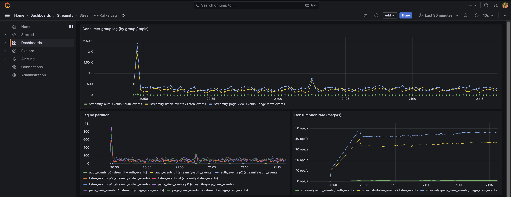
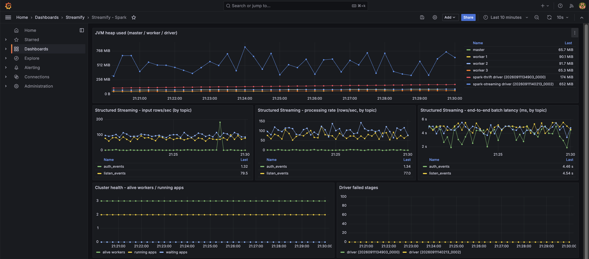
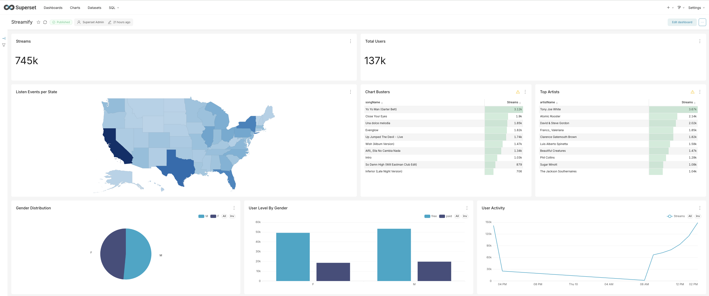

# Streamify: End-to-End Music Event Data Platform

Streamify is a comprehensive data engineering project that demonstrates a full, end-to-end data pipeline. It simulates, processes, and analyzes real-time music streaming events, transforming raw data into actionable business intelligence.

This platform captures simulated user interactions (like 'song played' or 'artist listened to'), processes them in real-time, stores them in a Hudi lakehouse, models them for analytics, and finally visualizes the resulting insights.

-----

## 💾 Dataset

[Eventsim](https://github.com/Interana/eventsim) is a program that generates event data to replicate page requests for a fake music website. The results look like real use data but are completely synthetic.

The Docker image is borrowed from [viirya's fork](https://github.com/viirya/eventsim), as the original project is unmaintained. Eventsim uses song data from the [Million Songs Dataset](http://millionsongdataset.com); this project uses a [subset](http://millionsongdataset.com/pages/getting-dataset/#subset) of 10,000 songs.

---

## 📈 Project Architecture & Data Flow

  

The project follows a modern lakehouse (ELT) architecture:

| Layer | Tool | Role |
|---|---|---|
| Data simulation | Eventsim | Generates synthetic music-streaming events based on the Million Songs Dataset |
| Message queue | Apache Kafka 4.3 (KRaft) | 2-node cluster, replication factor 2, 3 partitions per topic — no Zookeeper |
| Stream processing | Apache Spark Structured Streaming (3.5.3) | Reads Kafka, decodes/enriches events, writes bronze tables to Hudi |
| Table format / storage | Apache Hudi | MERGE_ON_READ bronze streaming tables, COPY_ON_WRITE gold/seed tables; MinIO (S3-compatible) locally, real S3 in `aws` mode via the Hadoop S3A connector (`s3a://`) — no separate catalog service, tables self-describe via a `.hoodie/` metadata directory and are registered into Spark's built-in catalog on startup; dev-vs-aws mode is picked by the `LAKE_ENV` env var (`rest`/`glue`) read at container start |
| Compute cluster | Spark Standalone (1 master, 2 workers) | Shared by the streaming job and dbt (via Thrift) — no headroom left for ad-hoc Spark SQL at this size |
| Transformation | dbt (`dbt-spark`, `method: thrift`) | SQL-based star schema and wide-table modelling, submitted to the Spark cluster via the Spark Thrift Server |
| Visualisation | Apache Superset | Dashboards connected to the Spark Thrift Server (HiveServer2-compatible) |
| Monitoring | Prometheus, Grafana, cAdvisor | Kafka consumer-group lag, Spark JVM/streaming metrics, per-container CPU/memory |
| Containerisation | Docker Compose | Single-command reproducible deployment; `docker-compose.dev.yml` overlay adds MinIO for local dev |

### Scaling Design

**Kafka** runs as a two-node KRaft cluster (`broker-1`, `broker-2`). Each of the three event topics (`listen_events`, `page_view_events`, `auth_events`) has **3 partitions** and **replication factor 2**, so every partition has a replica on both brokers — no data loss if one broker restarts.

**Spark** runs as a standalone cluster: 1 master + 2 workers (2 cores / 2 GB each). Two long-running applications share the same 4 cores — the `spark-streaming` job (Kafka → Hudi bronze, capped at 2 cores) and the `spark-thrift` Thrift Server that dbt submits SQL through (capped at 2 cores) — using the full cluster, with no headroom left for ad-hoc Spark SQL at this size. Structured Streaming resumes from a persisted checkpoint volume (`spark-checkpoints`) on restart; each micro-batch also commits its Kafka offsets to a `streamify-<topic>` consumer group purely so lag is visible in Grafana (Spark itself never depends on that commit to resume).

**Monitoring** is provided by a Prometheus + Grafana stack with pre-built dashboards:
- **Kafka Lag** — consumer-group lag and consumption rate per topic
- **Spark** — streaming/batch job metrics, JVM heap, per-container CPU and memory (via cAdvisor)

### Access URLs

| Service | URL |
|---|---|
| Spark Master UI | http://localhost:8086 |
| Spark Worker UI | http://localhost:8087-8088 |
| Superset | http://localhost:8888 |
| Prometheus | http://localhost:9090 |
| Grafana | http://localhost:3000 |
| MinIO Console (dev only) | http://localhost:9001 |

1.  **Data Simulation (Eventsim):** Real-time music event data (e.g., page views, song plays) is generated using **[Eventsim](https://github.com/Interana/eventsim)** to simulate a real-world user base.
2.  **Ingestion & Messaging (Kafka):** The raw event data is captured by **Apache Kafka 4.3** running in **KRaft mode** (no Zookeeper) as a 2-node cluster. Each topic has 3 partitions with replication factor 2 for fault tolerance.
3.  **Real-Time Processing (Spark Structured Streaming):** A long-running Spark job consumes all three topics, fixes latin1-mojibake on text fields, derives time columns, and appends each micro-batch to bronze Hudi tables (`staging.<topic>`), using the MERGE_ON_READ table type so fast streaming appends land as delta log files, periodically compacted into columnar base files.
4.  **Lakehouse Storage (Hudi):** Tables are Hudi-managed, backed by MinIO/S3 locally or real S3 in `aws` mode via the Hadoop S3A connector — no rebuild needed to switch, just an env var. There is no separate catalog service; each table is self-describing at its storage path (a `.hoodie/` metadata directory) and is (re-)registered into Spark's catalog idempotently at job startup.
5.  **Data Transformation (dbt):** dbt connects to the Spark cluster via the **Spark Thrift Server** (`method: thrift`) and builds a clean, analytics-ready **star schema** plus a denormalized wide table, straight on top of the bronze Hudi tables, materialized as COPY_ON_WRITE Hudi tables rebuilt via full overwrite each run.
6.  **Business Intelligence (Apache Superset):** **Apache Superset** connects to the same **Spark Thrift Server**, querying the `wide_streams` model to visualize insights through interactive dashboards.
7.  **Monitoring (Prometheus & Grafana):** **Prometheus** scrapes Kafka consumer-group lag (via kafka-exporter), Spark's built-in Prometheus metrics, and per-container stats (via cAdvisor). **Grafana** visualizes all of it across dashboards.

---

## 🗂️ Data Modeling & Transformation (dbt)

This project uses dbt to manage and execute two main types of data models, running entirely on the Spark cluster via the Thrift Server:

1.  **Star Schema:**
    * This is the primary, normalized storage model.
    * It consists of one central fact table (`fact_streams`) and five dimension tables (`dim_users`, `dim_songs`, `dim_artists`, `dim_locations`, `dim_datetime`).
    * This structure is highly efficient for storage, maintaining data integrity, and avoiding redundancy.

  

2.  **Wide Table (`wide_streams`):**
    * This is a wide, denormalized table built *from* the star schema.
    * **Purpose:** To provide a single, "flattened" table for BI tools (Superset).
    * **How it works:** It pre-joins the `fact_streams` table with all five dimension tables.
    * **Benefits:** By performing the JOINs in advance, this model simplifies queries in Superset, significantly improves dashboard loading speeds, and makes it easier for end-users to self-analyze data without needing to understand complex relationships.

  

-----

## 📡 Monitoring Dashboards

Grafana dashboards (`monitoring/grafana/dashboards/`) backed by Prometheus:

* **Kafka Lag** (`kafka-lag.json`) — consumer-group lag and consumption rate per topic.

  

* **Spark** (`spark.json`) — cluster health, JVM heap, streaming throughput/latency per topic, worker resource usage.

  

-----

## 📊 Results Dashboard

Visualizations are built in Apache Superset (`superset/provision_dashboard.py` provisions them via the REST API), connected directly through the Spark Thrift Server to the `wide_streams` model. Layout below is the original dashboard design that the Superset provisioning script replicates.

  

-----
